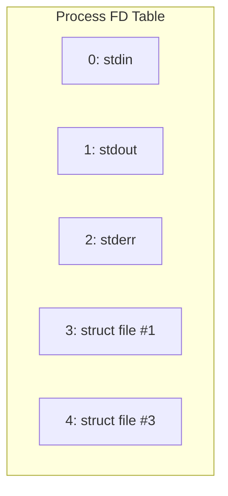
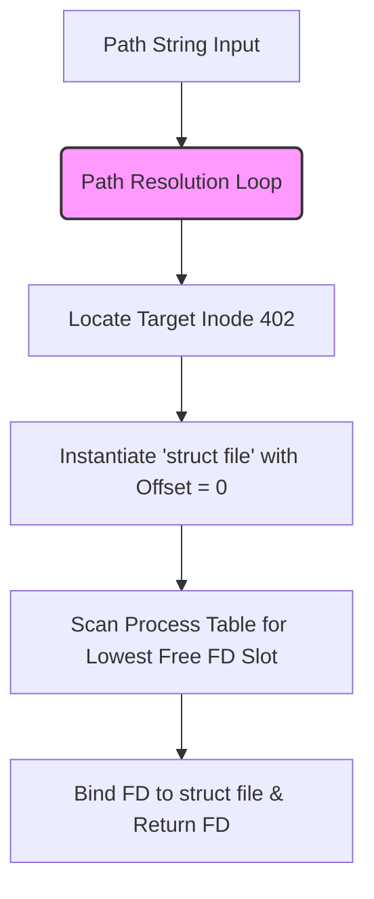
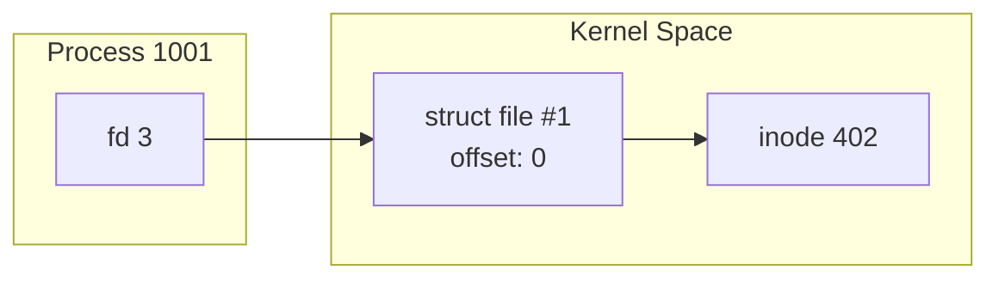
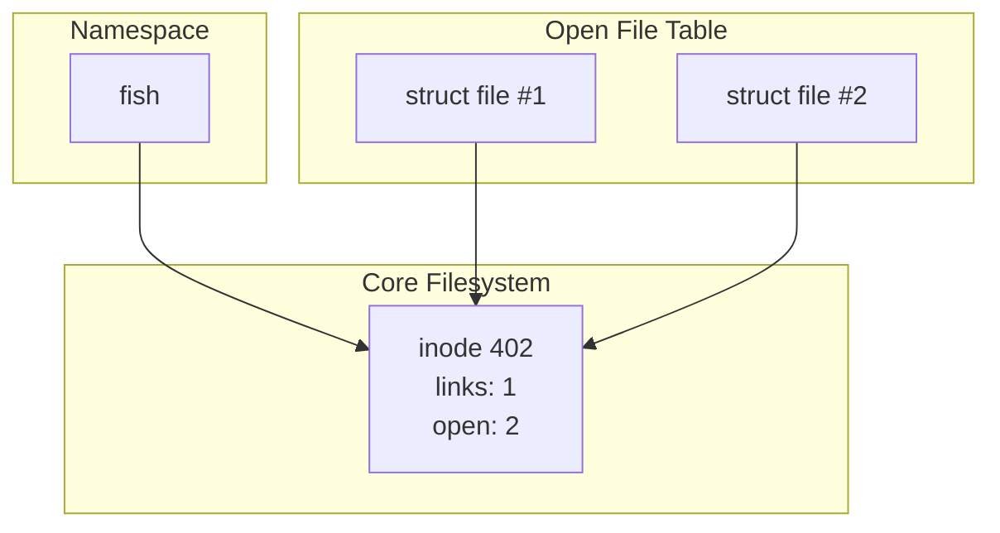
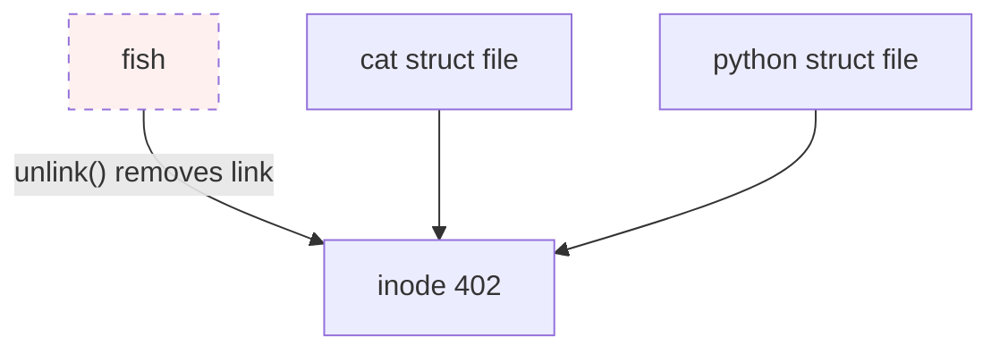
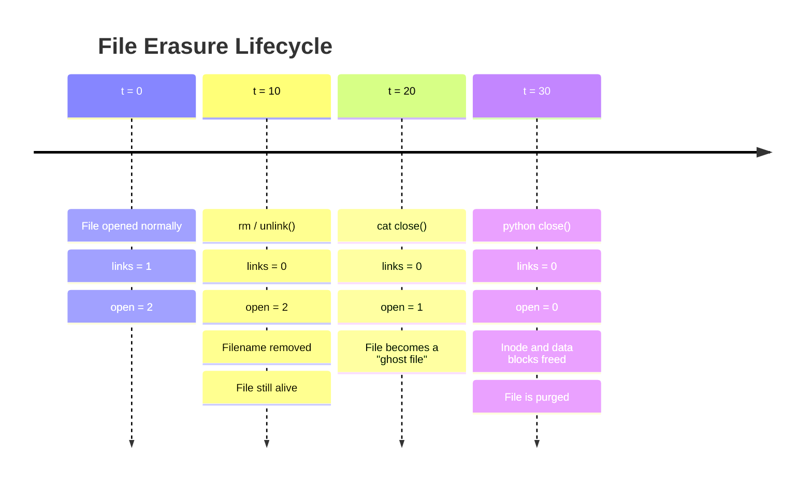
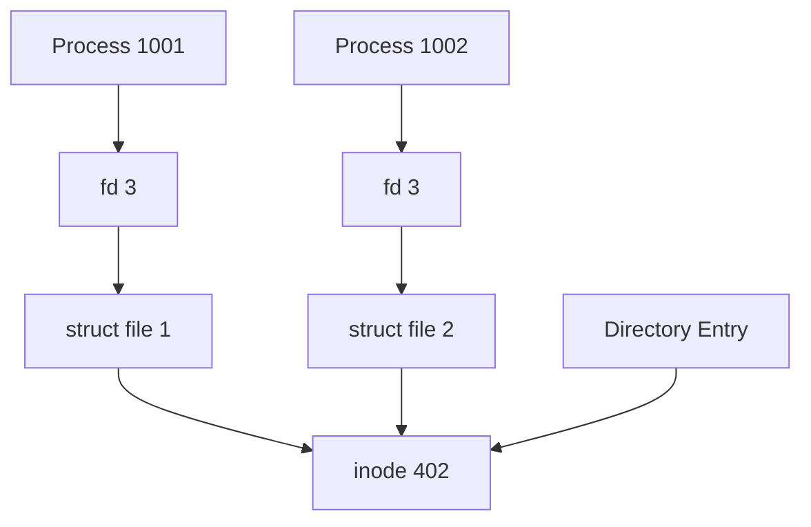

# Unix Filesystem Core Architecture

## 1. The 4 Structural Pillars

### 📂 File Descriptor (fd)
* **Per-Process Index:** A small integer scoped strictly within a single process.
* **FD Table Assignment:** Functions as a direct index into the kernel-level file descriptor table for that process.
* **Standard Channels:**
	* `0`: `stdin`
	* `1`: `stdout`
	* `2`: `stderr`
* **Allocation Rule:** `open()` always assigns the **lowest available** non-negative integer.
* **Process Isolation:** The exact same FD number across different processes is entirely independent.
* **Lifecycle:** `close(fd)` immediately clears that slot, making it eligible for subsequent reuse.



### 📄 Open File Table Entry (`struct file`)
* **Dynamic Kernel Object:** Dynamically instantiated by the kernel upon executing `open()`.
* **Session Representation:** Tracks **how** a specific file is being accessed during a live session.
* **Core Encapsulated Metadata:**
	* Reference to the underlying **inode**
	* Session flags and access modes (`O_RDONLY`, `O_WRONLY`, `O_CREAT`)
	* **Current File Offset:** The active read/write cursor position
	* **Reference Count:** Number of active FDs pointing to this structure
* **Cursor Isolation:** Separate `open()` invocations generate distinct `struct file` instances with separate cursors.
* **Implicit Sharing:** Instances can be shared across processes via `fork()` or cloned within a process via `dup()`.


### 🧬 Inode (Index Node)
* **Physical Representation:** The unique filesystem object representing the actual file payload and metadata.
* **Core Encapsulated Metadata:**
	* File type (regular file, directory, symlink)
	* Ownership (UID/GID) and permissions (rwxrwxrwx)
	* Physical block mappings on the storage medium
	* **Hard Link Count:** Number of directory entries mapping to this node
	* Active reference count tracking live opens
* > [!IMPORTANT]
> **The Inode is Nameless.** Inodes store absolutely no filename data. Filenames exist purely within directory mappings.

### 🗺️ Directory Entry (`dentry`)
* **Logical Mapping Layer:** Bridges the human-readable namespace to the kernel's numerical layout:
  $$\text{Filename} \longrightarrow \text{Inode Number}$$

```c
[ fish ]     ──> Inode 402
[ cookie ]   ──> Inode 403
[ meow.txt ] ──> Inode 895
```

* **Path Resolution Engine:** Actively traversed by the VFS (Virtual File System) to convert a path string into a specific inode.
* **Transient Cache:** Once `open()` successfully resolves a file, the descriptor operates directly on the underlying kernel structures; the string name is no longer needed. Recent translations are kept in the highly performant **dentry cache**.

---

## 2. Path Resolution Mechanics

When resolving an absolute path like `/home/nini/catfood/fish`, the kernel sequentially evaluates the chain of directory entries:


> [!NOTE] Traversal Pipeline
> 1. Start execution at the root directory (`Inode 2`).
> 2. Validate current user `x` (execute/search) permission on the current directory inode.
> 3. Scan the directory blocks for the target subdirectory/file name mapping.
> 4. Extract the target inode number and step into it.
> 5. Repeat steps until the final target leaf is reached.

---

## 3. The `open()` Lifecycle

```c
int fd = open("/home/nini/catfood/fish", O_RDONLY);
```

### Allocation Pipeline


Assuming standard channels (`0`, `1`, `2`) are closed or busy, the architecture binds as follows:



---

## 4. `read()` & File Cursor Control

```c
read(3, buf, 4); // Request 4 bytes via FD 3
```


* **Execution 1:** The kernel accesses `struct file #1`, reads 4 bytes starting from current cursor position `0`. The cursor shifts: $\text{offset: } 0 \longrightarrow 4$.
* **Execution 2:** A consecutive call to `read(3, buf, 4)` resumes exactly where the previous operation ended: $\text{offset: } 4 \longrightarrow 8$.

> [!WARNING] Where does the offset live?
> The current file offset belongs **exclusively** to the `struct file` entry. It does not belong to the File Descriptor, the Inode, or the Namespace.

---

## 5. Concurrent Access: Multiple Processes

If two separate processes independently open the exact same file path:

```c
// Process 1001 (cat)
open("fish", O_RDONLY); -> returns fd 3

// Process 1002 (python)
open("fish", O_RDONLY); -> returns fd 3
```

While both processes hold a local reference numbered `3`, their isolated process spaces point to distinct session entries:

```mermaid
graph NT
    subgraph Process 1001 (cat)
        fd_cat[fd 3]
    end
    subgraph Process 1002 (python)
        fd_py[fd 3]
    end
    subgraph Kernel Open File Table
        sf1[struct file #1 <br> offset: 8]
        sf2[struct file #2 <br> offset: 0]
    end
    subgraph Filesystem
        in402[inode 402]
    end

    fd_cat --> sf1
    fd_py --> sf2
    sf1 --> in402
    sf2 --> in402
```

> [!SUCCESS] Core Takeaway
> Independent `open()` invocations spawn isolated file cursors. Operations executed by the `python` process will never alter the read position of the `cat` process.

---

## 6. Table Management & Descriptor Recycling

```c
fd2 = open("cookie", O_RDONLY);   // Returns lowest free: fd 4
fd3 = open("meow.txt", O_RDONLY); // Returns lowest free: fd 5
close(4);                         // Frees up slot 4
fd4 = open("cookie", O_RDONLY);   // Re-allocates lowest free: fd 4 (Not 6!)
```

---

## 7. Destruction Mechanics: `close()`

When executing `close(4)`, the kernel breaks the bond between the process environment and the open file structures:


### The Kernel Garbage Collection Rule
$$\text{Ref Count} \longrightarrow 0 \implies \text{struct file is deallocated}$$

> [!CAUTION] Crucial Distinction
> Clearing a file descriptor **does not** trigger automatic deletion of the physical inode or storage blocks.

---

## 8. Resource Trackers: `links` vs `open`

An active inode tracks its lifecycle via two explicit internal counters:

| Counter | Definition | Purpose |
| :--- | :--- | :--- |
| **`links`** | Hard link counter | Tracks directory entries pointing to this inode. |
| **`open`** | Reference counter | Tracks live `struct file` objects pointing to this inode. |



---

## 9. Deleting Files: `rm` / `unlink()`

Executing `rm fish` calls the underlying `unlink()` system call.



* The entry mapping `fish ──> inode 402` is dropped from the directory structure.
* The link count drops: $\text{links: } 1 \longrightarrow 0$.
* **Survival Status:** Because $\text{open} = 2$, the node stays **completely alive**. The processes holding open descriptors can continue running operations on the file payload without interruption.

---

## 10. Ultimate File Erasure Lifecycle

Physical deletion of data blocks and inode reclamation occurs **only** when both tracking counters drop to zero.

$$\text{links} == 0 \quad \mathbf{AND} \quad \text{open} == 0 \implies \text{Purge Storage Blocks}$$

### Complete Breakdown Timeline



* **The `rm` / `unlink()` 
* **Event (t=10) to (t=20):** When a user runs `rm`, the file entry is instantly unlinked from the directory tree namespace. The filesystem `links` count drops to `0`. However, because the kernel sees active sessions (`open == 2`), **no data blocks are wiped, and the inode remains pinned in memory.** 
* **The "Ghost File" State (t=20) to (t=30):** After `cat` terminates or calls `close()`, the `open` count decrements to `1`. The file is now a "ghost"—completely invisible to any new processes trying to look it up via `open()`, yet still fully readable and writable by the surviving `python` process. * 
* **The Final Purge (t=30\):** Only when `python` drops the final reference (`open == 0`) does the kernel VF
---

### Section 11 — FD → Struct File → Inode



