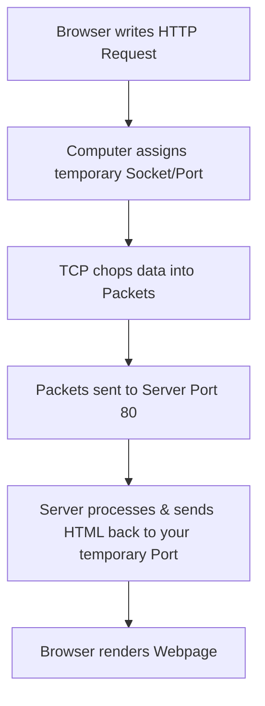

# 🌐 Networking Basics: HTTP, TCP/UDP, Packets & Sockets

## 📝 The Core Concept
Sending data over the internet is like sending a multi-page book through the mail. 

> [!NOTE] 
> **The Summary:** 
> You write an **HTTP** request, specify the destination **Socket** (Server IP + Port 80), and your computer opens a temporary socket. **TCP** chops that request into **Packets** and ensures they are safely delivered. The server reads it, generates **HTML**, and sends it back via TCP to your temporary socket, where your browser displays the webpage.

---

## 📦 The Postal Analogy Breakdown

| Term | What it means | The Postal Analogy |
| :--- | :--- | :--- |
| **HTTP** | **HyperText Transfer Protocol**. The rules and formatting for web data. | **The Language of the Letter.** (Writing "Dear Server, please give me the homepage," in a format it understands.) |
| **Packets** | **Small chunks of data**. Large files (like a webpage) are chopped into tiny pieces to travel across the internet efficiently. | **The Pages of the Book.** You can't fit a whole book in one small envelope, so you tear the pages out and mail them in separate, numbered envelopes. |
| **TCP** | **Transmission Control Protocol**. A delivery method that guarantees **100% accuracy**. It numbers packets, checks for errors, and puts them back in order. | **Registered Mail with Delivery Confirmation.** If page 3 gets lost, the post office notices, asks for a re-send, and won't give you the book until every page is there. |
| **UDP** | **User Datagram Protocol**. A delivery method that favors **speed over accuracy**. It shoots packets out fast without checking if they arrived. | **Regular Mail.** The mailman throws the pages at your door. If page 5 is missing, he doesn't care. Great for live streams or gaming; terrible for loading text/code. |
| **Sockets** | An **IP address combined with a Port number** (e.g., `192.168.1.1:80`). It is the unique doorway connecting two specific apps. | **The Mailbox + Apartment Number.** The IP gets the mail to the correct building; the Port makes sure it goes to the right apartment (e.g., Port 80 for Web). |

---

## 🔄 The 4-Step Flow of a Web Request

### 1. The Request (HTTP)
Your browser writes a structured letter asking for a webpage. 
* *Example:* `GET /index.html HTTP/1.1`

### 2. The Doorways (Sockets & Ports)
To send the letter, you need a sender and a receiver doorway:
* **The Server's Endpoint:** `Server_IP_Address:80` (Port 80 is the public entrance reserved for incoming web requests).
* **Your Endpoint:** `Your_IP_Address:51234` (Your computer automatically creates a **temporary, random port** just for this specific tab's conversation).

### 3. The Delivery (TCP & Packets)
**TCP** takes the HTTP letter, chops it into small **Packets**, stamps them with the socket info, and manages the delivery. Because it uses TCP, no packets are lost, and they are reassembled in the correct order when they arrive at the server.

### 4. The Return Journey (HTML)
The server reads the request, generates the **HTML** code for the website, and hands it to TCP. TCP sends the HTML packets back across the internet, addressed directly to **your temporary port (e.g., 51234)**. Your browser receives it and displays the webpage.

---

## ❓ How does the Browser know the Port?

The browser knows which port to use through **Global Standards** and the **URL Prefix**.

### 1. The Step-by-Step Discovery Process
* 📥 **Type URL:** You type `http://google.com` into your browser.
* 🏷️ **Read Protocol:** Browser reads `http://` and automatically sets the target **Port to 80**.
* ☎️ **DNS Lookup:** Browser asks DNS (the phonebook): *"What is the IP for google.com?"* DNS replies: `142.250.190.46`.
* 🔗 **Build Socket:** Browser fuses them into the complete Destination Socket: **`142.250.190.46:80`**.

## ☎️ What is DNS (Domain Name System)?

DNS is the **"Phonebook of the Internet."** It translates human-readable domain names (`google.com`) into machine-readable IP addresses (`142.250.190.46`).

### 📍 Where does it live?
* **Locally (Your Device):** Your computer keeps a short-term memory (**DNS Cache**) of websites you recently visited so it doesn't have to ask the internet every time.
* **Globally (The Internet):** The master databases live on decentralized, dedicated **DNS Servers** managed by Internet Providers (ISPs), tech companies (like Google's `8.8.8.8` or Cloudflare's `1.1.1.1`), and global internet authorities.

### ⛓️ How does DNS map Names to IPs?
1. **Domain Registration:** A company (like Google) buys a domain name and registers it.
2. **Creating the Record:** They create an **"A Record"** (Address Record) mapping their name to their server's actual IP address.
3. **The Hierarchical Lookup:** When you type a URL, your computer fetches this record via a quick chain of command:
   * **You** ➡️ **ISP Resolver** ➡️ **Root Server** ➡️ **TLD Server (.com)** ➡️ **Authoritative Name Server (Google's Server)** ➡️ **IP Address returned to you!**

### 1. Hardcoded Default Ports
The internet uses standardized ports for common applications. Your browser automatically appends the port based on the protocol:
*   `http://` → Automatically defaults to **Port 80**
*   `https://` → Automatically defaults to **Port 443**

### 2. The Custom Port Exception
If a server uses a non-standard port, it must be explicitly declared in the URL using a colon (`:`).
*   *Example:* `http://example.com:8080` tells the browser to connect to **Port 8080** instead of 80.

