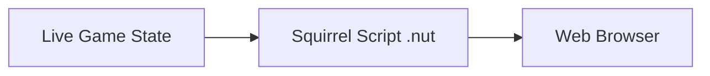
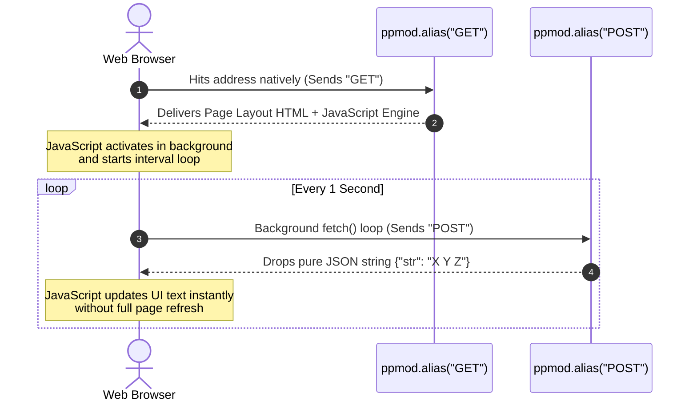

## 🔍 Analyzing Connections: `lsof` & Game Ports

### 1. The `lsof -i -P` Command
This command is used in macOS/Linux terminal to audit active network connections.
* **`lsof`**: List Open Files (networks are treated as files).
* **`-i`**: Show only Internet/Network connections.
* **`-P`**: Show raw Port numbers instead of text names (e.g., `80` instead of `http`).

### 2. High Ports (e.g., `:60452`, `:57343`)
* Ports ranging from **49152 to 65535** are **Ephemeral (Temporary) Ports**.
* They are not permanently assigned to any specific app.
* When hosting games like **Portal 2**, the game engine uses these random high ports as temporary doorways to talk to Steam matchmaking, voice servers, or verify game data, while the main game traffic usually runs on **Port 27015**.


## 🎮 Hardcore Networking: The `-netconport` Web Server Hack

### 1. What is `-netconport`?
* It is a Valve Source Engine launch flag (`-netconport <port>`) that opens a remote **TCP console socket**.
* It acts like an unencrypted **SSH / Telnet tunnel**, allowing administrators to issue direct commands and modify the game server remotely.

### 2. How it allows "Game-to-Web" Hosting
* **The Layer:** Unlike normal game traffic which uses UDP, `-netconport` forces the game to open a **TCP socket**. Since HTTP also relies on TCP, web browsers can physically connect to this port.
* **The Exploit:** Browsers send a `GET` request. The game interprets this as an "unknown console command." By writing specialized server scripts or aliases that force the game console to echo back standard `HTTP/1.1 200 OK` headers and HTML text, **Portal 2 can technically serve web pages to a browser**.

## 🔧 Netcat: Direct Socket Interaction (`nc localhost 3000`)

### 1. What is Netcat (`nc`)?
* Often called the **"Network Swiss Army Knife."**
* It is a terminal utility used to establish raw **TCP or UDP connections** to read and write data directly across network sockets.

### 2. Breakdown of the Command: `nc localhost 3000`
* `nc`: Executes the Netcat tool.
* `localhost`: Tells it to connect to your own local machine (`127.0.0.1`).
* `3000`: Specifies the targeted network **Port**.

### 3. Why Use it in Socket Experiments?
* **No Middleware:** Unlike a web browser (which automatically formats and parses text into visuals), Netcat gives developers access to the **raw, unfiltered TCP stream**.
* **Debugging Tool:** It allows an experimenter to manually type an HTTP request (`GET / HTTP/1.1`) to see exactly how a server (or a hacked game server) behaves, or send direct text strings into a remote console port like `-netconport`.

## 🎮 Code Proof: The `mapspawn.nut` Exploit

This script is located inside the game directory at `scripts/vscripts/mapspawn.nut`. It uses the Squirrel scripting language to turn the Source Engine console into a functional web protocol handler.

### 📄 The Code
```squirrel
ppmod.alias("GET", function () {
    printl("HTTP/1.1 200 OK");
    printl("Server: Portal 2");
    printl("Content-Type: text/html");
    printl(""); // Crucial blank line required by HTTP standards
    printl("<h1>Hello from Portal 2</h1>");
    printi("");
});
```

### ⚙️ How It Works
* **Command Interception:** `ppmod.alias` binds the browser's native protocol word `GET` to an in-game script function.
* **Header Spoofing:** The `printl()` functions feed official HTTP compliance headers straight into the active TCP socket pipe.
* **Rendering:** The browser reads the raw text coming out of the game console port, mistakes the game engine for an actual web hosting infrastructure (like Apache or Nginx), and renders the `<h1>` HTML element.


## 🔌 Linking the `.nut` Script to the Portal 2 Engine

You do not need external modding tools or software injection to connect Squirrel (`.nut`) files to *Portal 2*. The game engine has native support built right in.

### 📁 1. The Automatic Directory Hook
The Source Engine automatically reads scripts placed in the specific game subdirectories:
* **Target Path:** `Portal 2/portal2/scripts/vscripts/mapspawn.nut`
* **The `mapspawn` Rule:** Files named precisely `mapspawn.nut` are prioritized by the game engine. They are executed **automatically** by the engine the moment a map finishes loading, before gameplay objects even materialize.

### 🎮 2. Activating the Entire Pipeline
To turn the script into a live web server connection:
1. **Open Ports via Steam:** Launch Portal 2 with the Steam Launch Option flag: `-netconport <port_number>`.
2. **Boot the Script:** Load any single-player or multiplayer map via the in-game developer console (`map <mapname>`).
3. **The Connection:** The map load triggers `mapspawn.nut` ➡️ The script intercepts `GET` commands via `ppmod.alias` ➡️ The `-netconport` socket feeds the text directly to the browser.

## ⚠️ The Core Problem: The Endless Netconport Stream
* Valve’s `-netconport` console behaves like a raw, continuous TCP text stream (similar to Telnet).
* When a web browser or an external tool sends an HTTP request to it, the game server treats that incoming text as an **unknown console command**.
* The server echoes that error text back into the pipeline and **never automatically closes the connection**.
* **The Symptom:** Because the stream keeps pouring raw console data into the pipeline, the browser gets confused, hangs indefinitely, and forces you to manually refresh the page just to see data updates.

## 🛠️ The Solution: The `Content-Length` Header
* By calculating the payload size and sending a `Content-Length: <bytes>` header inside the Squirrel (`.nut`) script, you give the client an explicit instruction.
* **How it works:** It tells the reading application (browser, script, or Obsidian) exactly how many bytes of data to expect for the message body.
* **The Result:** The moment the client reads that exact number of bytes, **it immediately stops reading the socket**. This cleanly slices off the response, completely locking out all the trailing "unknown command" console noise.

## 🚀 The Big Picture: Bridging Live Game Data
* **Direct Access:** Because your script runs natively inside the live Source Engine environment, it has direct access to live, changing server variables (like `cube.GetOrigin()`).

* **Takeaway:** Now that the communication line cuts off perfectly at the exact byte boundary without leaking console trash, you have a clean data stream. This allows you to print live game variables directly onto a website or pull them into an external ecosystem seamlessly.

## 🚫 Why Portal 2 Cannot Read the URL Path
* **The Reality:** Portal 2 is not a real production web server; it is a live game console console (`-netconport`) pretending to be one. 
* **The Constraint:** The console reads every incoming network transmission exactly like a player typing into the console window. It parses text line-by-line and **only interprets the very first word of a line as the command/alias**, discarding everything else.
* **The Consequence:** When a browser sends a standard request line like `GET /cube-position HTTP/1.1`, the game engine splits the string:
  * It reads **`GET`** (the first word) and fires your `ppmod.alias("GET")` function.
  * It completely **throws away** the rest of the line (`/cube-position HTTP/1.1`).
* **Takeaway:** You cannot create different sub-pages or custom URL endpoints (like `/health` or `/coords`). The script can never see the path address.

---

## 💡 The Trick: Exploiting HTTP Methods (`GET` vs `POST`)
Because you cannot change the address path, you must change the **HTTP Request Method** (the very first word of the network string) to separate your script logic.

* **`GET / HTTP/1.1`** \(\rightarrow\) First word is `GET` \(\rightarrow\) Triggers `ppmod.alias("GET")`
* **`POST / HTTP/1.1`** \(\rightarrow\) First word is `POST` \(\rightarrow\) Triggers `ppmod.alias("POST")`

By changing the method signature, you trick the game console into routing traffic into two entirely separate, isolated scripting channels over the exact same port.

---

## 🔄 The Two-Step Live Tracking Architecture
The video creator splits responsibilities between `GET` and `POST` to build a clean, modern background data pipe.

### 1. The `GET` Alias (The Delivery Vehicle)
* **What it does:** Runs when you first load the address in a browser tab.
* **What it returns:** The permanent HTML skeleton layout structure along with the JavaScript tracking loop (`<script>`).
* **Why it's here:** JavaScript *must* live inside the `GET` response because a browser cannot natively load a visual webpage user interface out of a raw `POST` connection.

### 2. The `POST` Alias (The Live Data Pipe)
* **What it does:** Triggered strictly in the background by the JavaScript loop running inside the loaded page (`fetch('/', { method: 'POST' })`).
* **What it returns:** A highly lightweight, raw JSON string containing nothing but the dynamic vector data: `{"str": "1250.00 432.00 -120.00"}`.
* **Why it's here:** It bypasses heavy text and HTML rendering layouts entirely. The JavaScript background workers hammer this lightweight endpoint every second, instantly pulling the raw variables directly into the view layout without freezing or forcing a full page reload.

---

## 📊 Complete System Flow Chart


